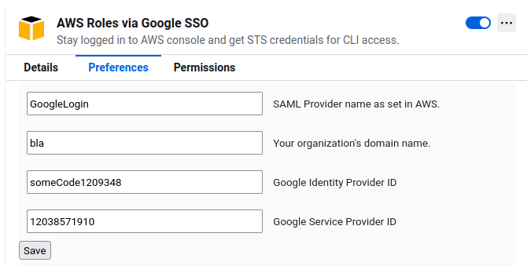

# AWS Roles via Google SSO

## Introduction
This repository holds the code for a browser extension that allows users that use
Google Workspace (gsuite) as an IDP provider to login
to AWS using roles.
It also has a local service that updates the local client AWS credentials for the aws-cli.
This extension can be used as an alternative to `aws-google-auth` and doesn't require filling credentials as long as your Google account is logged in to your browser, nor does it suffer from constant captchas.
The extension has been tested on Chrome and firefox.

## Features
- Refresh AWS Web Console session automatically to keep user logged in.
- Get temporary credentials for assumed role to use for CLI access.
- Autofill all available AWS roles for Google Workspace account.
- Automatically update local aws credentials file.

## Installation

### Option 1 (Chrome, Firefox)
Available directly on Chrome Web Store and Add-ons for Firefox:

<a href="https://chrome.google.com/webstore/detail/aws-alwayson/lfplgkokagjgodoeojaodphmjdhlpega" target="_blank" rel="noopener noreferrer"></a>
<a href="https://addons.mozilla.org/en-US/firefox/addon/aws-roles-via-google-sso/" target="_blank" rel="noopener noreferrer"></a>


### Option 2
 **Google Chrome:**
1. Clone this repository.
2. Go to the Chrome Extensions page.
3. Enable Developer Mode on the right side of the page.
4. Press "Load Unpacked".
5. Pick the project folder.

**Mozilla Firefox:**
1. Clone this repository.
1. Delete the regular manifest.js and rename the manifest-firefox.js to manifest.js
2. Go to Addons and themes in the hamburger menu.
3. Click the wheel and then Debug Add-ons.
4. Click Load Temporary Add-on... and select the manifest.json file.

## Using the extension
First you will need to configure some properties in the Options menu. Each property has additional info that you can read to help you set it up properly.



When you are done, exit the Options menu.
Now you can add your user's IAM role or roles or click the (A) button to initiate autofill.


Click on the slider to start the token auto refresh procedure.
After enabling the refresh you can also click on the CLI button to get the temporary STS credentials.

### Updater Service installation
The credentials updater service runs a minimalistic webserver on 127.0.0.1:31339 that listens requests for updates from the extension.
To enabled this feature, click the toggle in the Options menu.

#### Linux: Golang based service:
*Linux users should use this version of the local service*

##### Requirements
```
netstat
```

##### Installation
1. Clone this repo
2. `cd aosvc`
3. `./install.sh`

#### macOS: Python based service
*MacOS users will benefit from using the python version of the local service.*

##### Installation
1. Clone this repo
2. `cd aosvc-python`
3. `./install.sh`

More info [here](/aosvc-python/README.md).
